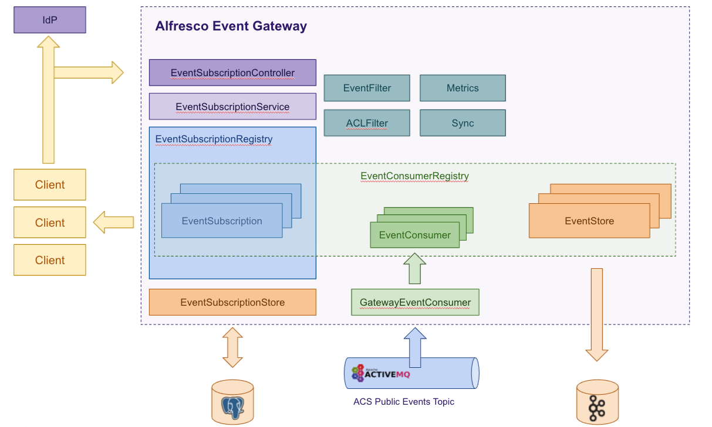

# Alfresco Event Gateway

<p align="center">
  </img>
</p>

## Event Sourcing POC

This is a POC to follow Event Sourcing approach in the Event Gateway. If you want to check the original documentation for the Alfresco Event Gateway please
visit the master branch [README](https://github.com/Alfresco/alfresco-event-gateway) file.

### Idea

The idea of this POC is applying the [Event Sourcing approach from Martin Fowler](https://martinfowler.com/eaaDev/EventSourcing.html) to the Alfresco Event
Gateway providing an implementation of an EventStorage interface that stores the ACS events consumed by the gateway in an event streaming data storage like
[Apache Kafka](https://kafka.apache.org/).



### Run POC

#### Pre-Requisites

Same as base event gateway configuration [here](https://github.com/Alfresco/alfresco-event-gateway#pre-requisites).

#### How To Run

The project provides a [docker-compose](docker-compose/docker-compose.yml) configuration of the components required to execute the Alfresco Event Gateway in a
local environment. This configuration has been modified to include all the Kafka infrastructure required for the POC (```zookeeper```, ```kafka```
, ```schema-registry```
and ```ksqldb```).

Apart from that, [a utility script](docker-compose/run.sh) will easy the startup and shutdown of these components.

To build and run the project simply use the utility script:

```
$ cd docker-compose
$ ./run.sh build_start
```

Once all the docker containers are up and running the system is ready to store the ACS events in Kafka and hence, it provides all the advantages of the Event
Sourcing approach described by Martin Fowler.

#### Querying the events in Kafka

We can use [ksqlDB](https://ksqldb.io/) to create custom streams from Kafka and execute different queries over the ACS events.

We're showing here the access to ksqkDB client from the console, but you can use a GUI like [Conduktor](https://www.conduktor.io/) to do the same in a GUI.

The steps to execute some queries in ksqlDB are:

1. Access to the ksqlDB docker container:

```
$ docker exec -it ksqldb-server /bin/ksql
```

2. Create a new stream from the Kafka topic configured in the property ```alfresco.event.gateway.storage.kafka.topic``` (defaulted
   to ```alfresco-event-gateway```):

```
ksql> CREATE STREAM events(
    id VARCHAR,
    type VARCHAR,
    source VARCHAR,
    time VARCHAR,
    data STRUCT<eventGroupId VARCHAR,
                resource STRUCT<name VARCHAR,
                                nodeType VARCHAR>>)
WITH (KAFKA_TOPIC='alfresco-event-gateway',
      VALUE_FORMAT='json',
      PARTITIONS=1);
```

3. Run a push query to check live the number of events produced per node type:

```
ksql> SELECT data->resource->nodeType NODE_TYPE, count(*) TOTAL
      FROM events
      GROUP BY data->resource->nodeType
      EMIT CHANGES;
```

4. Run a push query to check live a histogram of the node types per event type, which shows how many nodes of each type has been created, updated or deleted:

```
ksql> SELECT type EVENT_TYPE, HISTOGRAM(data->resource->nodeType) NODE_TYPES
      FROM events
      GROUP BY type
      EMIT CHANGES;
```

5. Run a push query to check live when the system is experiencing a peak in its activity. The next query detects the reception of more than 10 events of a
   specific type within a 20 seconds interval:

```
SELECT type EVENT_TYPE, count(*) TOTAL, WINDOWSTART, WINDOWEND
FROM events
WINDOW TUMBLING (SIZE 20 SECONDS)
GROUP BY type HAVING COUNT(*) > 10
EMIT CHANGES;
```

From this point, you can modify the queries (and eventually the mapping of the stream created in the step 2) to produce any reporting data you are interested
in.
